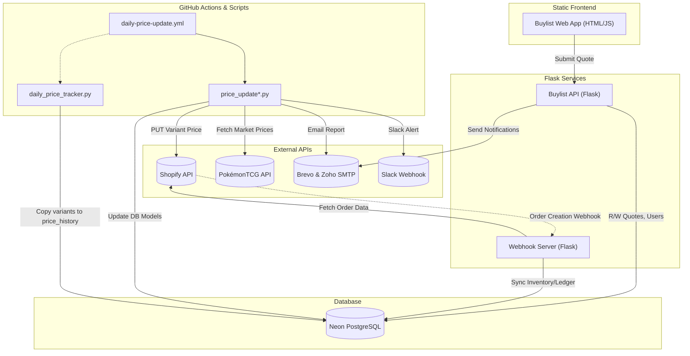
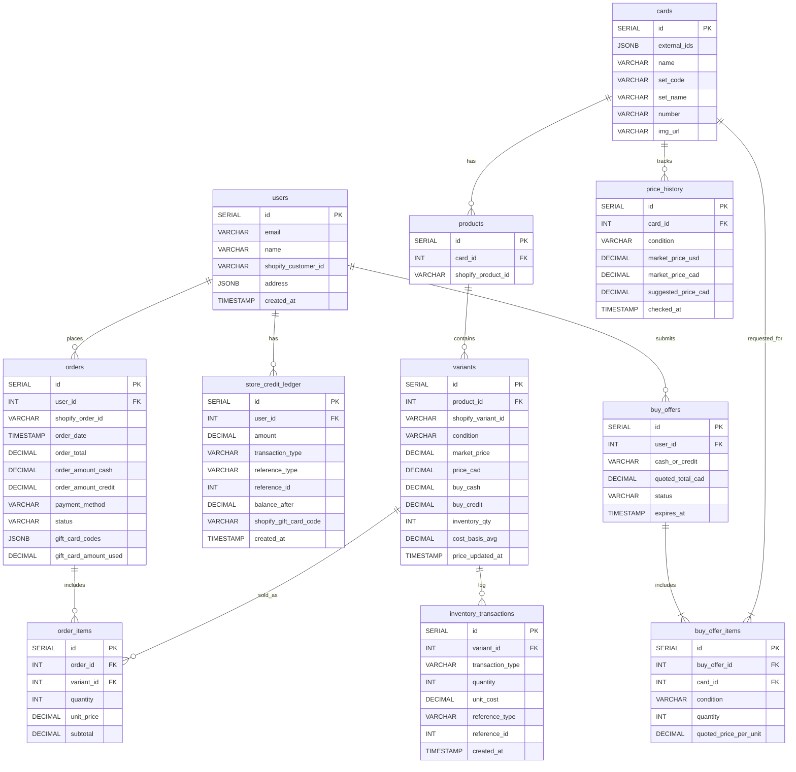

# Dumpling Collectibles - Complete Architecture & System Spec

This document details the exact state of the Dumpling Price Automation system today. 

**System Context:** This repository represents a completely decoupled, standalone web application that operates alongside the main Dumpling Collectibles Shopify storefront. Its primary responsibilities are acting as a dynamic nightly pricing engine, maintaining an internal inventory ledger, and hosting a custom "Buylist" web portal (C2B) that handles dynamic customer sale quotes—a feature Shopify natively lacks.

## 1. High-Level Architecture Overview

## 2. Database Schema (PostgreSQL)

Below is the Entity-Relationship (ER) diagram for the main tables governing inventory, users, Shopify syncing, and the buylist.

## 3. API Data Providers & Critical Constraints

Because we rely on external services that aggressively rate-limit, the codebase incorporates varying levels of concurrency and back-off delays. These bottlenecks dictate our update speeds and dictate how the nightly automation functions.

### A. PokémonTCG API (`api.pokemontcg.io`)
*   **Purpose:** Fetches market prices (specifically extracting TCGPlayer normal/holofoil/reverse) to calculate base CAD pricing.
*   **Constraints:** High rate-limiting. A linear script (without API Keys or when throttled) requires progressive sleep times. `price_update_by_series.py` dictates ~21 seconds per card under strict conditions to prevent complete lockouts (`HTTP 429: Too Many Requests`).
*   **Structure:** We issue individual `GET /v2/cards/{external_id}` calls per card.

### B. Shopify API
*   **Purpose:** Acts as our source of truth for POS and eCommerce inventory.
*   **Constraints:** Shopify has REST Admin API bucket limits (typically 2 requests/sec on basic plans).
*   **Structure:** 
    *   **Price Syncing:** Our scripts update variant prices by hitting `PUT /admin/api/2025-01/variants/{id}.json` directly. This happens sequentially per variant, with manual `sleep(0.3)` constraints programmed into scripts like `price_update.py`.
    *   **Webhooks:** During an order webhook, we must fetch the API at `GET /admin/api/2025-01/orders/{id}.json` to extract deep gift-card transaction data missing from the raw webhook payload.

### C. Email Providers (Brevo / Zoho)
*   **Structure:** Used dynamically. The Flask APIs (`buylist_app.py`) natively execute internal/customer emails via the **Brevo REST API (`POST /v3/smtp/email`)**. The automated Python scripts use standard Python `smtplib` via **Zoho SMTP or Brevo SMTP relays** to construct and send HTML strings representing price movement reports.

### D. Slack Notifications
*   **Purpose:** Simple price change monitoring.
*   **Structure:** Scripts like `scripts/slack_sender.py` utilize `requests.post` to a single `SLACK_WEBHOOK_URL` to notify administration of distinct inventory value impacts and pricing adjustments.

---

## 4. Automation Scripts & Cron Jobs (Nightly Updating)

All primary autonomous processes currently run through **GitHub Actions** (`workflows/`).

### Daily Price Automation (`workflows/daily-price-update.yml`)
*   **Schedule:** Runs at Midnight EST (5am UTC) every day.
*   **Execution Target:** The workflow file points to `python price_update_ultra_conservative.py`. *(Note: This file appears to be missing or substituted in the current directory; standard operations fall back to `price_update.py` and `price_update_by_series.py`)*.
*   **Logical Flow:**
    1.  **Preparation**: Extracts active card IDs with Shopify variants via `SELECT` statements from the Neon Postgres DB.
    2.  **Processing (Parallel or Series-Based)**: Scripts like `price_update.py` chunk the cards into 3 parallel execution threads to speed up processing while resting `sleep(3+)` for timeouts. 
    3.  **Filtration Thresholds**: The system only pushes an update if the calculated market price, adjusted by the store's internal markup, exceeds configurable percentage and flat-dollar movement thresholds compared to the current price.
    4.  **Buylist Cash/Credit Calculation**: Before updating the database, the script calculates dynamic buylist pricing based on the card's `market_price` (CAD). 
        *   The system uses an internal sliding-scale percentage algorithm to establish progressive Cash and Store Credit offers for Near Mint (NM) items based on their overall market value.
        *   Degraded conditions (LP, MP) proportionately reduce the NM buylist target via condition-based multipliers, ignoring heavily damaged cards entirely.
    5.  **Shopify Push**: Valid changes are committed to the DB (`buy_cash` and `buy_credit` are saved directly to the `variants` row) and then instantly `PUT` to the Shopify Admin API for each distinct condition (`NM`, `LP`, `MP`, `HP`, `DMG`).
    6.  **Reporting**: A full summary of modified variants is emailed to administration.

### Internal Database Snapshot (`scripts/daily_price_tracker.py`)
*   **Execution Target:** Locally copies the `market_price` logic directly from the `variants` table and pushes it into the historical `price_history` table as a snapshot.
*   **Purpose:** Doesn't involve external APIs—it purely records a historical ledger to measure store pricing changes over time.

### Manual Issue Store Credit Workflow (`workflows/issue-store-credit.yml`)
*   **Trigger:** Manual GitHub Action `workflow_dispatch`.
*   **Execution Target:** `issue_store_credit_automated.py`.
*   **Purpose:** Allow admins to manually input a customer email and an amount to generate a buylist payout or manual refund. 
*   **API Structure:** Fires a `POST /admin/api/2025-01/gift_cards.json` to Shopify to generate a live gift card code, records the transaction in `store_credit_ledger`, and uses Brevo to email the customer the code.

---

## 5. User Interaction Flows (Customer Facing)

*Note: Standard customer eCommerce purchases (B2C) are fundamentally handled on the external Shopify storefront. This codebase's custom Javascript frontend exists strictly to handle the complex C2B (Customer-to-Business) "Buylist" flow, allowing users to interactively search and submit lists of cards for immediate cash or store credit quotes based on the natively tracked market pricing matrix.*

### 5.1 Buylist Quoting (`frontend/` & `api/buylist_app.py`)
1.  **Discovery:** User loads the Vanilla JS site and queries a card name. The `GET /api/cards/search` endpoint only returns cards actively bought by checking if `v.buy_cash > 0` and groups condition variables (`NM`, `LP`, etc.).
2.  **Cart Assembly:** User selects condition/quantities and chooses a preferred payout method (**Cash** or **Store Credit**).
3.  **Submission:** The `POST /api/buylist/submit` endpoint handles the payload:
    *   Creates/fetches user information in the DB using their email.
    *   Verifies against the `variants` table to pull the live `buy_cash` or `buy_credit` value that was cached by the nightly price automation job.
    *   Calculates real-time price sub-totals for each line item.
    *   Inserts into the `buy_offers` ledger (Quote ID) and `buy_offer_items` for individual cards.
    *   Pings Brevo Email API to notify internal team and email the customer the quote.

### 5.2 Webhook Processing (`webhook/webhook_server.py`)
1.  **Receipt:** Shopify hits `POST /webhooks/shopify/orders/create` upon any checkout.
2.  **Validation:** The payload is verified via `X-Shopify-Hmac-Sha256` signature using our DB `SHOPIFY_WEBHOOK_SECRET`.
3.  **Transaction Resolution:**
    *   If payment gateways specify `gift_card`, the script launches a raw `GET` fetch against the Shopify REST API for deeper sub-transaction insight (the webhook payload alone obscures used card codes).
4.  **Database Syncing:**
    *   Logs the order payload into `orders` and subtracts `inventory_qty` internally in `variants`.
    *   Creates `inventory_transactions` rows representing the sale tracking the `cost_basis_avg`.
    *   If a gift card was used, a negative flow is entered into `store_credit_ledger` for that user.

---

## 6. Required Transitions For Re-Write

When porting this logic to a structured backend (FastAPI/Django) and React UI, specific focus must be directed at our **API rate constraints**:

1.  **Pricing Background Jobs:** The `price_update*.py` architecture relies heavily on rudimentary thread pausing (`time.sleep`) and linear operations. It restricts our capability to add Multi-API aggregates. We must use a dedicated queue worker (like Celery/RabbitMQ) with managed retries (e.g. `ExponentialBackoff` algorithms without blocking worker threads).
2.  **Bulk Shopify Updates:** Modulating prices via individual `PUT /variants/{id}.json` triggers maximum rate limits fast. Shopify GraphQL API `productVariantsBulkUpdate` mutations should be used to hit dozens of variant prices in a single API roundtrip.
3.  **Missing Files Integrity:** Investigate the cron discrepancy where `daily-price-update.yml` requests `price_update_ultra_conservative.py` to assert the correct execution flow for today's market conditions.
